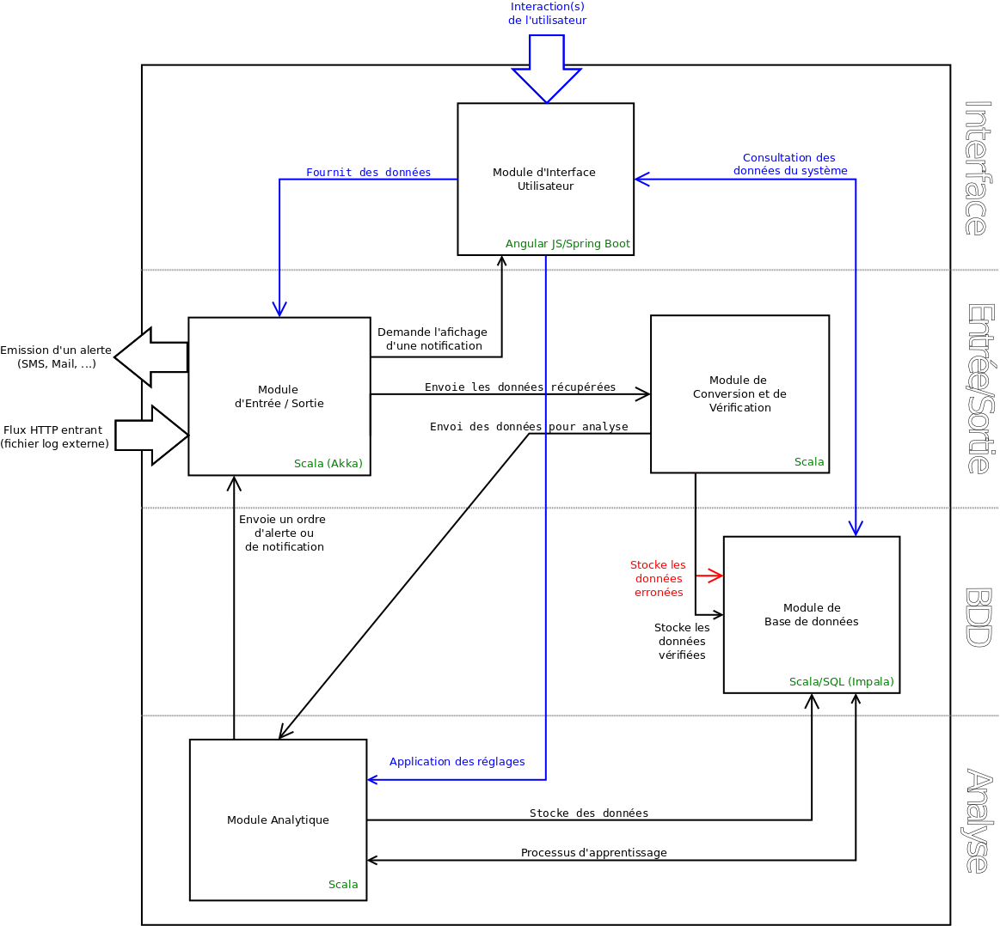

# Rapport du projet - SmartLogger

## Synthèse des Technologies
### Architecture globale 
Vous trouverez sur le diagrammme ci-dessous l'architecture globale de _SmartLogger_ tels qu'elle estaujourd'hui.

Nous pouvons voir sur ce diagrammme la présence de 5 modules majeures :
- Module d'Entrée / Sortie
- Module d'Interface Utilisateur
- Module de Conversion / Vérification
- Module de Base de Données
- Module Analytique

Nous allons voir dans la partie suivante le fonctionnement de chacun des modules de manières plus détaillées.
SmartLogger est une application RESTFUL, étant données que l'on communique avec ce service via un ensemble de règle présente dans le cadre d'un service REST.
On y retrouve la réception de log suivant une route prédéfinie préalablement par SmartLogger. Il est aussi possible de communiquer avec SmartLogger via un ensemble de règle pour manager son comportement durant son execution (ré-entrainer son modèle, ...).

### Présentation des composants & des Technologies
#### Module d'entrée
Le module d'entrée à pour but de recevoir des requêtes HTTP contenant les logs récçus de systèmes externes tels que des serveurs, des applications, ...
L'entrée fonctionne via le framework _akka_, permettant le réception de requête HTTP de tout type, afin de permettre la transmission de logs depuis des services externes.
Pour cela, il utilise un _Batch_  se vidant toutes les X secondes, afin de stocker les logs reçu depuis l'extérieur, puis d'exécuter une analyze de l'ensemble des logs stocker dans le _Batch_ de manière cyclique.

#### Module de Conversion / Vérification
Ce module permet de "nettoyer" les logs reçu afin de garder uniquement les données valides, dont a besoin SmartLogger pour fonctionner. Il est constitué d'une classe `LogParser` permettant de parser et de nettoyer les logs reçu afin de ne garder le contenu nécessaire au fonctionnement du module analytique.

####Module Analytique
Le module analytique représente le coeur de l'application, celui-ci est constitué de 2 classes. 
La première : `AnalyzerBuilder` permet de facilement changer l'algorithme utilisé par l'analyseur. Cette classe permet l'implémentation des algorithmes suivant : 
- NaiveBayes
- LogisticRegression
- DecisionTreeClassifier
- RandomForestClassifier
La classe principale du module est la classe `SmartAnalyzer`, celle-ci a pour rôle de représenter la partie analytique de SmartLogger. Utilisant les algorithmes issues du framework _Apache Spark_, cette classe est capable de prédire des évenements en fonction d'un modèle prédéfini par l'utilisateur de l'application. Son rôle dans le projet consiste, à partir d'un ensemble de logs reçu du _Batch_ du module d'entrée, à prédire si ceux-ci sont _critique_ dans le cadre de sa génération ou bien si ceux-ci sont routinier est n'indique aucun problème de fonctionnement du serveur ou du service externe.

#### Module de Base de Données
Le module de base de données est le module gérant la persistance des données au seins de SmartLogger.
Pour cela, il est constitué d'un ensemble de classe ayant pour but de créer et de manipuler une base de données _Impala_, afin notamment de pouvoir stocker l'ensemble des logs reçu par SmartLogger.
Pour cela, on retrouve une classe permettant la connection à la base de données, ainsi qu'une seconde classe permettant la manipulation courante (cd : Méthode CRUD) des éléments dans la base de données.

#### Module d'Interface Utilisateur
Ce module est externe au projet SmartLogger. En effet, cette interface est facilement interchangeable par une autre interface, tant que le respect des règles du service de SmartLogger sont respectées.
Ici, on y retrouve les trois frameworks suivant : _Angular JS_, _Bootstrap Twitter_ et _Spring Boot_, les deux premiers utilisés dans le cadre de la Vue de l'interface. Le troisième est quant à lui utilisé côté Back-End, afin de définir les **routes** permettant de communiquer avec SmartLogger. 

#### Module de Sortie
Le module de sortie de SmartLogger permet, en cas de _log_ ayant un niveau de criticité important de prévenir les équipes via un envoi d'_e-mail_ contenant les logs critiques ou via le logiciel de discussion instantanné _Slack_. Pour cela, SmartLogger possède une classe `Alerter`, permettant en cas de rencontre avec un _log_ critique d'alerter les personnes concernées via les sorties prédéfinies.
Nous retrouvons ici l'_API Slack_ pour l'envoi sur une sortie Slack et la librairie _Javax Mail_ pour l'envoi de mail depuis une classe Scala.

#### Module complémentaire
A ces différents modules, nous retrouvons un module complémentaire en la présence de classe utilitaire. 
Ces classes sont utilisées afin d'externaliser un ensemble de configuration hors du code dans des fichiers _properties_. 
Ces classes permettent ainsi de charger des fichiers properties afin d'intégrer au code les clés d'API de Slack, les adresses mails, ou encore d'autre configuration qu'il est nécessaire d'externaliser, afin notamment de facilité le deployement de l'application sur un serveur prédéfini.

### Présentation des Technologies
Maintenant que nous avons défini ensemble les différentes modules et les technologies liées.
Nous allons revenir sur les technologies de manière plus détaillé, afin notamment d'expliquer l'intérêt de celles-ci dans le cadre de SmartLogger, ainsi que les technologies potentielles qui auraient pu être mis en place en remplacement de ce qui est présent actuellement. 

#### Un langage : Scala

#### Un framework de gestion des flux HTTP : Akka

#### Un framework pour la gestion de l'apprentissage : Apache Spark

#### Une librairie pour l'API Slack : Scala-Slack

#### Un gestionnaire de dépendance : Gradle

### Extensions des technologies 

