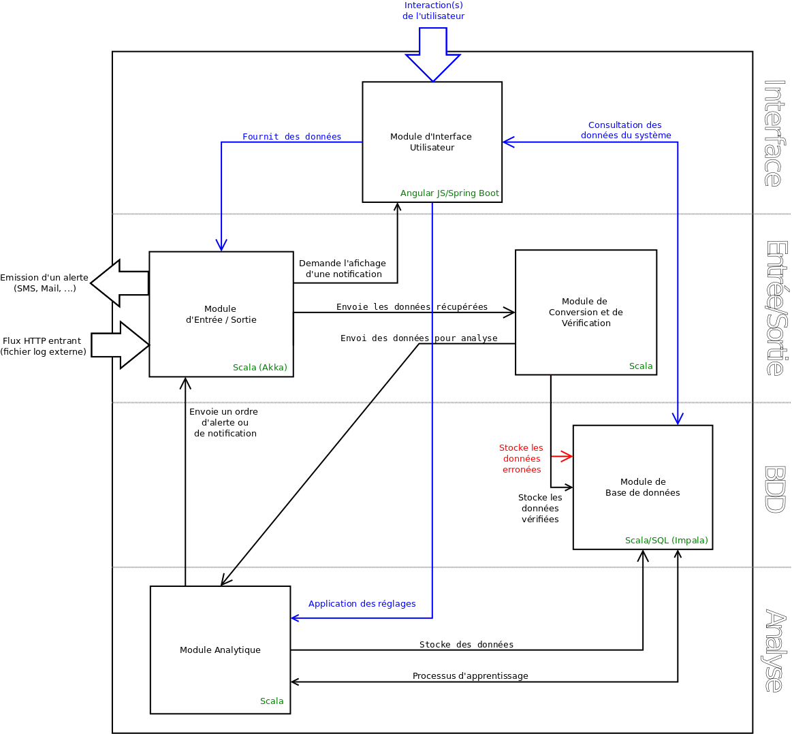

# Rapport du projet - SmartLogger

## Synthèse des Technologies
### Architecture globale
Vous trouverez sur le diagrammme ci-dessous l'architecture globale de *SmartLogger* tels qu'elle est aujourd'hui.

Nous pouvons voir sur ce diagrammme la présence de 5 modules majeurs :

- Module d'Entrée / Sortie
- Module d'Interface Utilisateur
- Module de Conversion / Vérification
- Module de Base de Données
- Module Analytique

Nous allons voir dans la partie suivante le fonctionnement de chacun des modules de manière plus détaillée.
SmartLogger est une application RESTFUL, justifié par le fait que l'on communique avec ce service via un ensemble de règle présente dans le cadre d'un service REST.
On y retrouve la réception de log suivant une route prédéfinie préalablement par SmartLogger. Il est aussi possible de communiquer avec SmartLogger via un ensemble de règle pour manager son comportement durant son execution (ré-entrainer son modèle, ...).

### Présentation des composants & des Technologies
#### Module d'entrée
Le module d'entrée à pour but de recevoir des requêtes HTTP contenant les logs reçus de systèmes externes tels que des serveurs, des applications, ...
L'entrée fonctionne via le framework *Akka*, permettant la réception de requête HTTP de tout type, afin de permettre la transmission de logs depuis des services externes.
Pour cela, il utilise un *Batch* se vidant toutes les X secondes, afin de stocker les logs reçu depuis l'extérieur, puis d'exécuter une analyse de l'ensemble des logs stocké dans le *Batch* de manière cyclique.

#### Module de Conversion / Vérification
Ce module permet de "nettoyer" les logs reçus afin de garder uniquement les données valides, dont a besoin SmartLogger pour fonctionner. Il est constitué d'une classe `LogParser` permettant de parser et de nettoyer les logs reçus afin de ne garder le contenu nécessaire au fonctionnement du module analytique.

#### Module Analytique
Le module analytique représente le coeur de l'application, celui-ci est constitué de 2 classes.
La première : `AnalyzerBuilder` permet de facilement changer l'algorithme utilisé par l'analyseur. Cette classe permet l'implémentation des algorithmes suivant :
- NaiveBayes
- LogisticRegression
- DecisionTreeClassifier
- RandomForestClassifier

La classe principale du module est la classe `SmartAnalyzer`, celle-ci a pour rôle de représenter la partie analytique de SmartLogger. Utilisant les algorithmes issues du framework *Apache Spark* et de la bibliothèque *ml.classification*, cette classe est capable de prédire des évenements en fonction d'un modèle prédéfini par l'utilisateur de l'application. Son rôle dans le projet consiste, à partir d'un ensemble de logs reçus du *Batch* du module d'entrée, à prédire si ceux-ci sont *critiques* dans le cadre de sa génération ou bien si ceux-ci sont insignifiants et n'indique aucun problème de fonctionnement du serveur ou du service externe.

#### Module de Base de Données
Le module de base de données est le module gérant la persistance des données au sein de SmartLogger.
Pour cela, il est constitué d'un ensemble de classe ayant pour but de créer et de manipuler une base de données *Impala*, afin notamment de pouvoir stocker l'ensemble des logs reçus par SmartLogger.
Pour cela, on retrouve une classe permettant la connection à la base de données, ainsi qu'une seconde classe permettant la manipulation courante (cd : Méthode CRUD) des éléments dans la base de données.

#### Module d'Interface Utilisateur
Ce module est externe au projet SmartLogger. En effet, cette interface est facilement interchangeable par une autre interface, tant que les règles du service de SmartLogger sont respectées.
Ici, on y retrouve les trois frameworks suivant : *Angular JS*, *Bootstrap Twitter* et *Spring Boot*, les deux premiers utilisés dans le cadre de la Vue de l'interface. Le troisième est quand à lui utilisé côté Back-End, afin de définir les **routes** permettant de communiquer avec SmartLogger.

#### Module de Sortie
Le module de sortie de SmartLogger permet, en cas de *log* ayant un niveau de criticité important de prévenir les équipes via un envoi d'*e-mail* contenant les logs critiques ou via le logiciel de discussion instantanné *Slack*. Pour cela, SmartLogger possède une classe `Alerter`, permettant en cas de rencontre d'un *log* critique d'alerter les personnes concernées via les sorties prédéfinies.
Nous retrouvons ici l'*API Slack* pour l'envoi sur une sortie Slack et la librairie *Javax Mail* pour l'envoi de mail depuis une classe Scala.

#### Module complémentaire
A ces différents modules, nous retrouvons un module complémentaire en la présence de classe utilitaire.
Ces classes sont utilisées afin d'externaliser un ensemble de configuration hors du code dans des fichiers *properties*.
Ces classes permettent ainsi de charger des fichiers properties afin d'intégrer au code les clés d'API de Slack, les adresses mails, ou encore d'autres configurations qu'il est nécessaire d'externaliser, afin notamment de faciliter le deployement de l'application sur un serveur prédéfini.

### Présentation des Technologies
Maintenant que nous avons défini ensemble les différentes modules et les technologies liées.
Nous allons revenir sur les technologies de manière plus détaillé, afin notamment d'expliquer l'intérêt de celles-ci dans le cadre de SmartLogger, ainsi que les technologies potentielles qui auraient pu être mis en place en remplacement de ce qui est présent actuellement.

#### Un langage pour tout unifier : Scala
Scala est une surcouche du langage de développement Java. Scala est un langage multi-paradigme permettant le développement via le paradigme objet ainsi que fonctionnelle. Nous avons choisi d'utiliser Scala dans l'entièreté du projet, car celui-ci procure un ensemble d'avantages non négligeables.

Celui-ci étant principalement rédigé en Scala, nous avons souhaité poursuivre entièrement en Scala, car celui-ci présente quelques avantages notamment le fait qu'il est moins *verbeux* que le Java, allégant ainsi le code produit. De plus, il est plus performant que le Java lors d'opération *multi_thread*, chose essentielle pour le module Analytique de SmartLogger. Pour finir, sur un plan purement didactique, la manipulation de ce nouveau langage nous a permis de nous confronter à de nouveaux modules de développement, ce qui accentue encore l'utilité du Scala dans le projet.

#### Un framework de gestion des flux HTTP : Akka
Ici, afin de suivre la continuité de développement en Scala, nous avons opté pour le framework *Akka* afin de gérer les requêtes HTTP reçus depuis les services et systèmes externes.
En effet, en plus de répondre au besoin que nous avons, celui-ci se révèle apte à supporter un ensemble de requêtes bien plus important que ce que nous lui imposons pour le projet SmartLogger. Concrétement, en cas de passage a une échelle supérieur de l'application, avec la réception de plusieurs milliers de logs à la seconde. Nous savons que SmartLogger pourra supporter la charge sans devoir revoir le fonctionnement du module d'entrée.

Les flux HTTP auraient pu être gérés via le framework *Spring-Boot*, notamment via le principe de *RestController* permettant, en fonction d'une *URL* précise (une route), de définir des actions à effectuer sur SmartLogger, tel que la récupérer de l'ensembles des logs stockés dans la base de données, ou encore le ré-entrainement du modèle afin de le corriger.
Cependant, dans l'optique que nous avions défini, nous avons préféré utiliser *Akka*, car celui-ci permettait de faire évoluer les futurs potentiels besoins de SmartLogger sur de gros volume de logs à traiter.

#### Un framework pour la gestion de l'apprentissage : Apache Spark
Afin de gérer l'apprentissage automatique de l'application, notre client nous a suggéré de nous axé vers la bibliothèque *mlLib.classification* du Framework *Apache Spark*, ce que nous avons fait dans un premier temps, puis après une mise à jour importante du Framework, l'attention s'est porté sur la bibliothèque *ml.classification*, celle-ci étant dédié au nouveau module de Spark, géré par sa nouvelle machinerie nommé *SqlSession*.
Après des essais, il était assez clair que l'un ou l'autre était parfaitement adapté à notre besoin, le changement n'apportant simplement que des optimisations temporels et visuels dans le code.

#### Une librairie pour l'API Slack : Scala-Slack
Concernant le contact auprès de l'*API Slack*, il était nécessaire de faire des recherches auprès du site de celui-ci. *Slack* étant utilisé par de plus en plus de développeurs, nous avons pu utiliser une bibliothèque dédié à la communication entre une application et l'*API Slack*.

#### Un gestionnaire de dépendance : Gradle
Afin de gérer les dépendances du projet, nous avons choisi d'utiliser *Gradle*. En effet, *Gradle* est un gestionnaire de dépendance utilisant le langage *Groovy* afin de gérer le téléchargement et l'utilisation des dépendances du projet SmartLogger.

Nous avons choisi d'utiliser *Gradle* car celui-ci est le gestionnaire le plus moderne, et celui qui semblait être le plus prometteur. Cependant, sa modernité rends la documentation de l'outil difficilement maniable due à une faible utilisation en comparaison avec des outils plus anciens tels que *Ant* ou encore *Maven*.

De ce fait, nous aurions pu utilisé *Maven* comme gestionnaire de dépendance, mais au vu des technologies que nous utilisions, nous avons opté pour les technologies les plus récentes possible, nous permettant par ce biais de nous former et nous intéresser à des technologies nouvelles.
